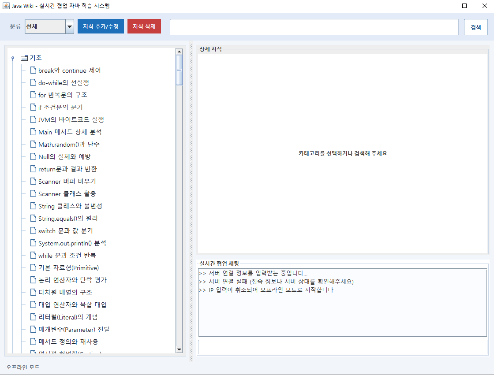
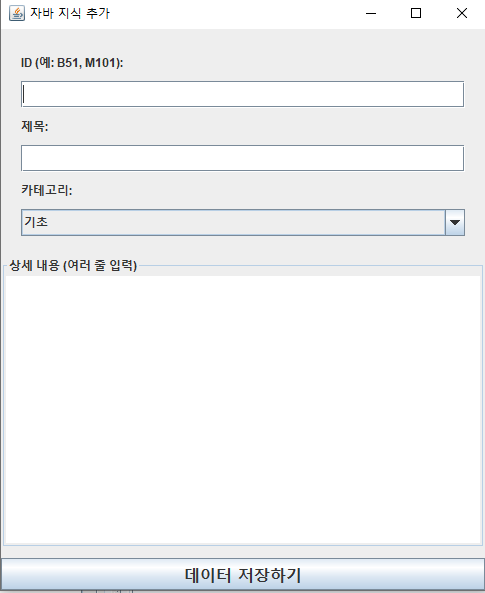
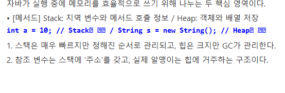

# JAVA WIKI

`JAVA_WIKI`는 Java 학습 개념을 검색/조회/추가/삭제하고, 소켓 기반 실시간 동기화와 채팅을 지원하는 Swing 프로젝트입니다.

## 목차
1. 프로젝트 개요
2. 현재 UI/UX 구조
3. 핵심 기능
4. 데이터 저장 정책(JSON)
5. 실시간 협업 동작
6. 실행 가이드
7. 최근 반영 사항
8. 다음 개선 후보
9. 코드 맵

## 프로젝트 개요
- 학습 개념(`Concept`)을 로컬 저장소(`ConceptRepository`)에 관리
- 검색(`SearchService`) + 상세 렌더링(`MainWikiFrame`) 제공
- 편집 창(`ConceptEditFrame`)에서 추가/수정 통합 처리
- 서버/클라이언트(`WikiServer`/`WikiClient`)로 실시간 동기화

## 현재 UI/UX 구조
### 메인 화면 구성
- 상단: `분류 드롭다운(전체/기초/중급/고급/메소드)` + `지식 추가/수정` + `지식 삭제` + 검색창
- 좌측: 카테고리 폴더형 트리(`JTree`)
- 우측 상단: 선택 개념 상세 패널(제목/분류/본문)
- 우측 하단: 실시간 채팅 패널

### 카테고리 단일화 + 폴더화 반영
- 기존 `전체/기초/중급/고급/메서드` 개별 버튼 구조 제거
- 카테고리 컨트롤을 `드롭다운 1개`로 단일화
- 목록을 `JList`에서 `JTree`로 변경해 폴더(카테고리) 아래 개념 항목 표시

### 검색/필터 동작
- Enter/검색 버튼 동일 동작
- 검색 결과를 트리로 재구성
- 카테고리 드롭다운 값(`currentCategory`)을 함께 적용

## 핵심 기능
### 1) 검색
- 키워드 기반 검색 + 오타 추천(`getBestMatch`)
- 검색 결과 없을 때 추천 개념 안내

### 2) 추가/수정
- `지식 추가/수정` 버튼으로 동일 편집 창 사용
- 선택된 항목이 있으면 수정, 없으면 신규 추가
- 저장 후 메인 목록 즉시 반영

### 3) 삭제
- 트리에서 개념 선택 후 삭제
- 확인 다이얼로그 후 제거
- 온라인 모드면 서버에도 `DELETE` 이벤트 전파

### 4) 상세 보기
- 본문 라인에서 `[H2]`, `[코드]/[CODE]` 태그 인식
- 코드 라인 강조 표시

### 5) 채팅/협업
- 채팅 입력 엔터 전송
- 서버 브로드캐스트 메시지 수신/표시

## 데이터 저장 정책(JSON)
### 저장 파일
- 기본 저장 파일: `data.json`
- 레거시 파일: `data.txt` (초기 1회 마이그레이션 용도)

### 로드/마이그레이션 정책
1. 시작 시 `data.json` 우선 로드
2. JSON이 비어 있고 `data.txt`가 존재하면 레거시 포맷을 읽어 마이그레이션
3. 마이그레이션 성공 시 즉시 `data.json`으로 저장
4. 둘 다 없으면 기본 샘플 데이터 시드

### 저장 시점
- 오프라인 모드: 창 종료 시 저장
- 온라인 서버 모드: `ADD/DELETE` 처리 직후 서버에서 즉시 저장

## 실시간 협업 동작
- 이벤트 타입: `ADD`, `DELETE`, `LIST`, `CHAT`
- 서버: 이벤트 반영 후 `REFRESH`/채팅 브로드캐스트
- 클라이언트: 서버 데이터 수신 후 UI 갱신(`applyServerData`)

## 실행 가이드
1. 서버 실행: `Reproject.WikiServer`
2. 클라이언트 실행: `Reproject.WikiClient`
3. 단독 실행(오프라인 테스트): `Reproject.Main`

## 최근 반영 사항
- JSON 포맷 저장/로드 체계 정착 (`data.txt` -> `data.json` 전환)
- 인코딩(UTF-8) 고정 설정 추가
- 카테고리 버튼 단일화(`JComboBox`)
- 카테고리 폴더형 목록(`JTree`) 적용
- 메인 UI 스타일(색상/패널/트리 렌더러) 개선
- 코드 라인 한글 깨짐 대응(코드 라인 폰트 호환 적용)

## 화면 캡처

> 아래 이미지는 `docs/screenshots` 기준입니다.

### 1) 메인 화면 (트리 + 상세 + 채팅)

### 2) 지식 추가/수정 입력창

### 3) 코드 라인 렌더링 예시

## 다음 개선 후보
1. 즐겨찾기/최근 본 항목 폴더
2. 저장 시 자동 백업(`data.backup/yyyyMMdd-HHmmss.json`)
3. 태그 기반 다중 필터(카테고리 + 태그)
4. 상세 패널 코드 블록 복사 버튼
5. 재연결 UX(자동 재시도/상태 표시 강화)

## 코드 맵
- 메인 화면: `src/Reproject/MainWikiFrame.java`
- 편집 화면: `src/Reproject/ConceptEditFrame.java`
- 검색 엔진: `src/Reproject/SearchService.java`
- 저장소/JSON 파싱: `src/Reproject/ConceptRepository.java`
- 서버: `src/Reproject/WikiServer.java`
- 클라이언트: `src/Reproject/WikiClient.java`
- 프로세스 안내: `src/Reproject/JavaWikiProcessGuide.java`