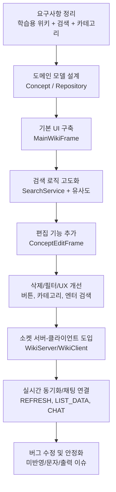
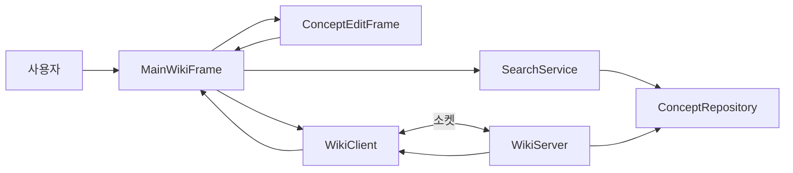

# Reproject Java Wiki

`Reproject`는 Java 학습 개념을 검색/조회/추가/삭제하고, 소켓 기반으로 여러 클라이언트가 실시간 동기화와 채팅을 수행하는 Swing 프로젝트입니다.

## 현재 구현 범위
- `MainWikiFrame`: 검색, 카테고리 필터, 상세 보기, 채팅 UI
- `ConceptRepository`: 개념 데이터 저장소(Map 기반), 전체/교체/삭제
- `SearchService`: 유사도(Levenshtein) 기반 검색 점수 계산
- `ConceptEditFrame`: 개념 추가/수정 입력 창
- `WikiServer` / `WikiClient`: 소켓 통신, 목록 동기화, 채팅 브로드캐스트

## 개발 순서도 초안


## 시스템 흐름(현재 코드 기준)


## 지금까지의 진행 흐름
기준: 최근 커밋 로그(2026-03-03 ~ 2026-03-06)
실제: 2026-02-16 ~ 2026-03-06 ...ing

1. 2026-03-03
- 메소드 개념 데이터 확장
- 프레임 내 메소드 버튼/주석 작업 시작

2. 2026-03-04
- 코드 구조 주석 정리 및 문자 깨짐 이슈 수정
- 검색/카테고리에서 메소드 노출 정책 보정
- 삭제 버튼 및 기능 추가
- 서버 기능 추가 후 소켓 통신 구현 시작

3. 2026-03-05
- 클라이언트 접속용 IP 가이드 보강

4. 2026-03-06
- 엔터 키 검색 동작 개선
- 소켓 통신 미반영 이슈 수정
- 프로그램 시작 시 출력 잘림 이슈 수정

## 파일 기반 저장소 업데이트 (추가)
- `ConceptRepository`는 시작 시 `data.txt`를 읽어서 메모리(Map)로 로드합니다.
- 종료 시 `repository.save()` 호출로 현재 메모리 상태를 `data.txt`에 저장합니다.
- `data.txt`는 메모장에서 직접 편집 가능한 구조입니다.

### data.txt 포맷
```txt
ID
제목
카테고리
설명/코드 여러 줄
---
```

예시:
```txt
M01
System.out.println()
메소드
[설명] 콘솔창에 데이터를 출력하고 줄을 바꾼다.
[코드] System.out.println("Hello Java");
---
```

### 저장 시점 주의
- 단독 실행(`Reproject.Main`)에서는 창 종료 시 저장됩니다.
- 서버/클라이언트 모드에서는 현재 코드 기준으로 서버 종료 시 저장되는 흐름이므로, 즉시 저장이 필요하면 서버의 `ADD/DELETE` 처리 직후 `save()` 호출을 추가하는 것을 권장합니다.

## 실행 가이드
1. 서버 실행: `Reproject.WikiServer`
2. 클라이언트 실행: `Reproject.WikiClient`
3. (단독 UI 확인용) `Reproject.Main` 실행 가능

## 다음 작업 후보
1. `UTF-8` 인코딩 통일 및 한글 깨짐 재점검
2. 데이터 저장 영속화(JSON/파일/DB) 추가
3. 네트워크 예외 재시도/재연결 UX 개선
